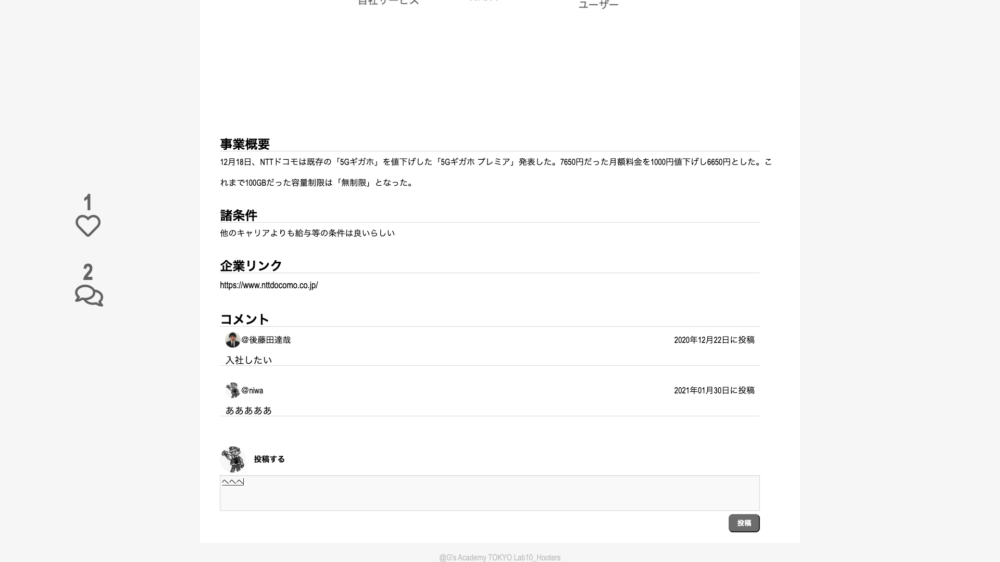

# 企業の業態分析・投稿プラットフォーム「hoooters」を作成しました。

## プロダクト概要

エンジニア転職志望者向けの、企業業態分析記事投稿プラットフォームです。個人が気になる企業を分析し、ピクト図、企業概要、各種条件について記事を作成し、投稿することで、「hoooters」メンバーへ記事の共有が可能です。

ページ構成は、welcome画面、ログイン画面、ホーム画面、記事作成画面、記事詳細画面、マイページ画面、マイページ編集画面の7ページとなっています。

4人のチームで、企画(3日間)→実装(7日間)まで約10日間程度で作成しました。私は主に、メンバー間の同一環境構築、ページ間のデータ受け渡し、コメント機能やお気に入り機能の実装など、細かい部分を担当しました。

【公開ページ】
http://tealimpala23.sakura.ne.jp/hoooters/public/welcome

Id = niwa@niwa.jp　,　pass = aaaaaaaaでご確認ください。

###### ①welcome画面

###### ②ログイン画面

###### ③ホーム画面

###### ④記事作成画面

###### ⑤記事詳細画面

###### ⑥マイページ画面

###### ⑦マイページ編集画面

## 作成背景

転職活動時、業界や企業分析に非常に時間が掛かります。そこで、同じコミニティー内のメンバーが、調べた企業の情報を記事にし、コミニティーメンバーに共有することで、業界/企業分析を効率化するできる様に作成しました。記事内でコメント機能をつけることにより、議論等も可能となっています。

## 使用技術
HTML、PHP、Laravel、node.js、MAMP、gitkraken

## 工夫した点

- メンバーの同一の環境構築

    gitkrakenを使用して、メンバー全員が同一環境を構築できるようにしました。具体的には、MAMP上で、Laravel、node.jsをインストール、プロジェクトファイルや共通ファイル(migrationファイル等)を作成した上で、リモートリポジトリに、pushし、各メンバーがリモートリポジトリを、git pullすることで、同一環境を構築しました。同一環境構築後、各メンバーがブランチを作成し、ローカルリポジトリへのgit commit、リモートリポジトリへのgit pushをすることで、作業を進めました。

- マイページ画面

    マイページ編集画面において、自己紹介文やSNS(github、twitter、facebook)のURLを入力すると、マイページ画面にプロフィールが表示されます。SNSの情報を入力している場合、SNSのアイコンが表示されます。また、自身が投稿した記事数やその一覧、いいねした記事数やその一覧(直近3つまで)が表示されます。

 
- いいね機能

    投稿された記事に「いいね」をできる機能を実装しました。ajaxを用いた非同期通信で、実装しています。記事詳細ページにおいて、ハートマークを押すと「いいね」ができます。尚、各ユーザーは、
    各記事に対して、一度しか「いいね」ができない様になっています。

- コメント機能

    記事詳細ページにおいて、各ユーザーがコメントを入力できる様にしました。コメントを投稿したユーザーのアイコンやコメント日時を、リアルタイムで表示できます。いいね機能と同様に、ajaxを用いた非同期通信で、実装しています。

- ログイン/ログアウト機能の実装

## 苦労した点
- ページ間のデータのやり取り

    チーム内で、ページ毎に役割分担をしていた為、ページを跨いで使うデータ(記事ID、ユーザーID等)のやり取りに苦労しました。各メンバーが各ページで、どの様にして、データを取得/保存しているのか、メンバー間で共有しながら、データのやり取りが発生する場合は、やり取りが発生するページの担当同士で、しっかり話し合いながら、作成しました。
    
- コンフリクト対策

    コンフリクトが発生しないように、作業するファイルと作業終了を共有するように、各メンバーに声かけを行い、コンフリクトが発生しないように心掛けました。結果として、大きなコンフリクトは発生せず、無事にチーム開発を終えることができました。

## 特に注力した点
- 新しい技術を早くキャッチアップすること

    初めて触る言語を、早く取得(デプロイする)することに心掛けかました。短い期間(10日間)で、LaravelのMVCモデルや文法を理解し、メンバー間で理解度の差が生じない様に、フォローしながら進めました。
    
- チームでの密接なコミニケーション
    
    成果物の仕様やDB構造の決定など、共通認識が必要な部分は、チーム全員で議論し決定しました。また、制作過程でも、チーム内での日次のto do確認や、わからないところの教え合いを行うことで、チーム開発に不備が発生しない様に、努めました。

    
